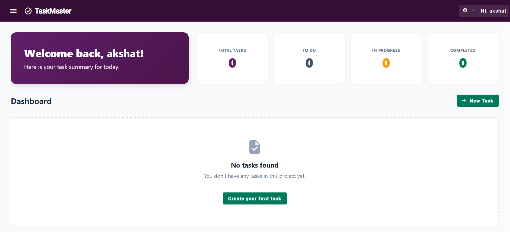
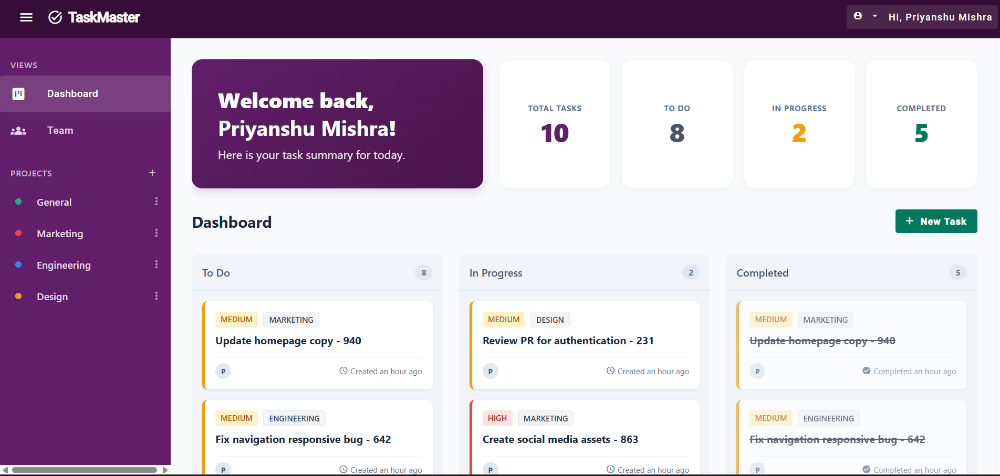
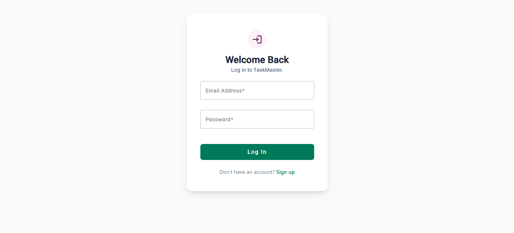
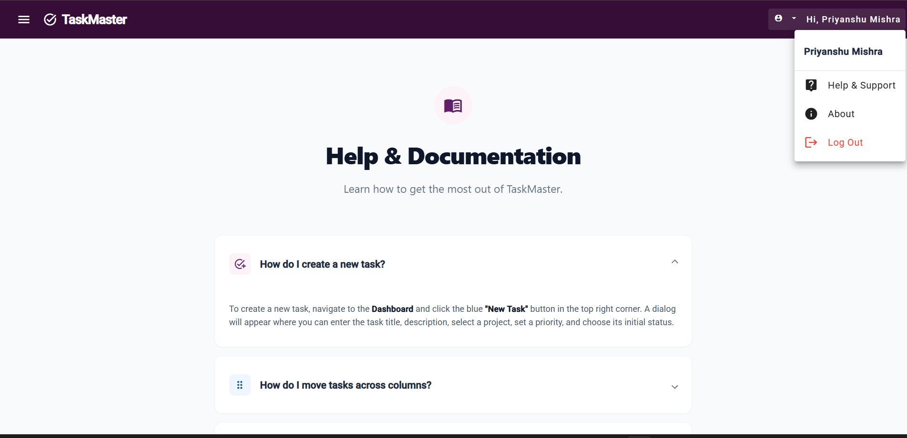

# 🚀 TaskMaster — Full-Stack Collaborative Task Management Platform

[](https://angular.dev/)
[](https://nodejs.org/)
[](https://expressjs.com/)
[](https://www.mongodb.com/)
[](https://www.typescriptlang.org/)
[](https://jestjs.io/)

**TaskMaster** is a modern, enterprise-ready task management and Kanban board application inspired by Slack's aubergine aesthetic. Built with Angular 18 signals and standalone components on the frontend, and a modular TypeScript Express REST API with MongoDB Atlas on the backend.

---

## 📸 Application Previews

| 📊 Kanban Board & Tasks | 📈 Summary Dashboard |
| :---: | :---: |
|  |  |

| 🔐 Authentication & Login | 📖 Help Center & Documentation |
| :---: | :---: |
|  |  |

---

## 🌟 Key Features

### 🔐 Authentication & Security
- **JWT & Password Hashing**: Secure user registration and login powered by `bcryptjs` and `jsonwebtoken`.
- **Route Guards & Interceptors**: Client-side `authGuard` guarding protected routes with an HTTP interceptor automatically injecting Bearer tokens and gracefully handling 401s.
- **Dedicated Auth Flow**: Full registration flow with client validation that seamlessly redirects to login upon account creation.

### 📋 Interactive Kanban Dashboard
- **Drag-and-Drop Workflow**: Angular CDK Drag and Drop enables real-time movement of tasks between `To Do`, `In Progress`, and `Completed` columns.
- **Interactive Task Modals**: Create, edit, inspect, and delete tasks directly from a Material dialog.
- **Dynamic Relative Time Formatting**: Custom `TimeAgoPipe` displays relative creation times (*e.g., "Created 2 hours ago"*).
- **Smooth Card Hover Effects**: Custom `HighlightDirective` for interactive card elevation and feedback.

### 📁 Custom Project Management
- **Project Organization**: Filter tasks by project (*General, Marketing, Engineering, Design, etc.*).
- **Custom Projects**: Add new project spaces and persist them per-user.
- **3-Dots Options Menu**: Project dropdown menu with custom Material confirmation dialogs for safe deletion.

### 👥 Team Directory & Support
- **Team Directory**: View team members and their assignments.
- **Help Center & Docs**: Expandable FAQ accordion with **JSON-LD SEO Structured Data** dynamically injected for search indexing.
- **Responsive Layout**: Mobile-optimized collapsible navigation drawer with Slack-inspired dark aubergine styling (`#611f69`).

---

## 🛠️ Tech Stack

### Frontend (`/frontend`)
- **Framework**: Angular 18 (Standalone Components, Signals, Control Flow `@if`/`@for`)
- **UI & Components**: Angular Material, Angular CDK (Drag & Drop)
- **Styling**: Modern CSS with CSS Grid, Flexbox, Custom Glassmorphism, Responsive Breakpoints
- **Environment Handling**: Dynamic runtime environment generation via `set-env.js` from `.env`

### Backend (`/backend`)
- **Runtime**: Node.js 22 + TypeScript (`tsx`)
- **Server**: Express 5 with modular routing and controllers
- **Database**: MongoDB Atlas with Mongoose ODM
- **Validation**: Schema-level request validation using Zod
- **Testing**: Jest + Supertest with In-Memory MongoDB (`mongodb-memory-server`)

---

## 📁 Repository Structure

```text
Exercise/
├── frontend/                     # Angular 18 Single Page Application
│   ├── src/
│   │   ├── app/
│   │   │   ├── core/             # AuthService, AuthGuard, AuthInterceptor
│   │   │   ├── shared/           # TimeAgoPipe, HighlightDirective
│   │   │   ├── board.component.ts        # Kanban Drag-and-Drop Board
│   │   │   ├── home.component.ts         # User Dashboard Overview & KPI Metrics
│   │   │   ├── task-dialog.component.ts  # Task Creation/Edit Modal
│   │   │   ├── users.component.ts        # Team Member Directory
│   │   │   ├── help.component.ts         # Help Center with JSON-LD Schema
│   │   │   ├── login.component.ts        # Authentication Login
│   │   │   ├── signup.component.ts       # Authentication Registration
│   │   │   ├── app.component.ts          # Shell Layout & Sidebar Navigation
│   │   │   └── todo.service.ts           # Signals-based State & HTTP Client
│   │   ├── environments/         # Environment Configurations
│   │   └── set-env.js            # Injects root/frontend .env into Angular environment
│   └── angular.json
│
├── backend/                      # Node.js + Express TypeScript REST API
│   ├── src/
│   │   ├── config/               # Database Connection Config
│   │   ├── controllers/          # Task & Auth Route Controllers
│   │   ├── middlewares/          # Auth, CORS, Logger, Central Error Handlers
│   │   ├── models/               # User & Task Mongoose Models
│   │   ├── routes/               # Modular Express Route Handlers
│   │   ├── validators/           # Zod Input Validation Schemas
│   │   └── __tests__/            # Jest & Supertest Integration Tests
│   ├── server.ts                 # Server Entrypoint
│   └── package.json
│
└── README.md                     # Project Documentation
```

---

## 🚀 Getting Started

### Prerequisites
- **Node.js**: `v18.x` or higher (`v22+` recommended)
- **npm**: `v9.x` or higher
- **MongoDB**: MongoDB Atlas URI or local MongoDB instance

---

### 1. Backend Setup

1. Navigate to the `backend` directory:
   ```bash
   cd backend
   ```

2. Install dependencies:
   ```bash
   npm install
   ```

3. Create a `.env` file in `backend/`:
   ```env
   PORT=3000
   MONGO_URI=your_mongodb_connection_string
   JWT_SECRET=your_super_secret_jwt_key
   ```

4. Start the backend development server:
   ```bash
   npm start
   ```
   *The server will run on `http://localhost:3000`.*

5. Run unit & integration tests:
   ```bash
   npm test
   ```

---

### 2. Frontend Setup

1. Navigate to the `frontend` directory:
   ```bash
   cd frontend
   ```

2. Install dependencies:
   ```bash
   npm install
   ```

3. Create a `.env` file in `frontend/`:
   ```env
   API_URL=http://localhost:3000/api
   ```

4. Start the frontend development server:
   ```bash
   npm start
   ```
   *The application will launch on `http://localhost:4200`.*

---

## 🌐 API Reference

### Authentication Endpoints
| Method | Endpoint | Description | Auth Required |
| :--- | :--- | :--- | :--- |
| `POST` | `/api/auth/register` | Register a new user | No |
| `POST` | `/api/auth/login` | Log in and receive JWT token | No |
| `GET` | `/api/auth/users` | List all registered team members | Yes (Bearer Token) |

### Task Endpoints
| Method | Endpoint | Description | Auth Required |
| :--- | :--- | :--- | :--- |
| `GET` | `/api/tasks` | Get all tasks for authenticated user | Yes (Bearer Token) |
| `POST` | `/api/tasks` | Create a new task | Yes (Bearer Token) |
| `GET` | `/api/tasks/:id` | Get specific task details | Yes (Bearer Token) |
| `PUT` | `/api/tasks/:id` | Update an existing task | Yes (Bearer Token) |
| `DELETE` | `/api/tasks/:id` | Delete a task | Yes (Bearer Token) |

---

## 🚢 Deployment Guide

### Backend on Render
1. Connect your repository to **Render** as a **Web Service**.
2. Set the **Root Directory** to `backend`.
3. Build Command: `npm install`
4. Start Command: `npm start`
5. Add Environment Variables:
   - `MONGO_URI`: Your MongoDB Atlas connection string.
   - `JWT_SECRET`: A secure random secret string.
   - `PORT`: `3000`.

### Frontend on Vercel
1. Connect your repository to **Vercel**.
2. Set the **Root Directory** to `frontend`.
3. Framework Preset: `Angular`
4. Build Command: `npm run build`

---

## 📚 Development Journey & Milestones

<details>
<summary><strong>Click to expand curriculum progress (Days 1–29)</strong></summary>

### 🗓️ Week 1: JavaScript & TypeScript Fundamentals
- **Day 1**: Pure utility functions with input validation & manual test suite.
- **Day 2**: Immutable array pipelines chaining `.map()`, `.filter()`, and `.reduce()`.
- **Day 3**: Async data fetching, loading/error flags, and parallel requests with `Promise.all`.
- **Day 4**: Full TypeScript migration with strict type definitions and zero `any`.
- **Day 5**: Node CLI file transformer using `fs/promises`.

### 🗓️ Week 2: Angular Frontend Development
- **Day 6–7**: Angular Signals state management, `@for` / `@if` control flow, and Kanban columns.
- **Day 8–9**: Injectable services, route parameters, lazy-loaded routes, and 404 page.
- **Day 10–12**: Reactive Forms with custom password validators, debounced search box with `switchMap`.
- **Day 13–15**: Custom `TimeAgoPipe` and `HighlightDirective`, Angular Material theme styling, and accessibility compliance.

### 🗓️ Express Backend & Full Stack Integration
- **Day 16–19**: Express 5 REST API, request logging middleware, and Zod schema validation.
- **Day 20–23**: JWT Auth flow, password encryption with `bcryptjs`, and MongoDB Atlas integration.
- **Day 24–25**: Automated test suite with Jest & Supertest (19 passing test cases).
- **Day 26–29**: End-to-end full stack connection, CORS configuration, interactive project management, custom Material confirmation dialogs, and responsive mobile sidebar.

</details>

---

## 📄 License
This project is licensed under the MIT License.