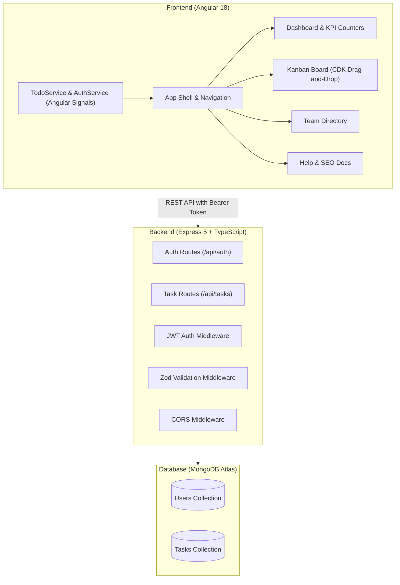

# 📋 TaskMaster — Project Walkthrough & Architecture Report

Welcome to the comprehensive walkthrough of **TaskMaster**, a full-stack, collaborative task management and Kanban board application. This document details the end-to-end user journeys, architecture decisions, verification results, and UI features.

---

## 📸 Visual Tour & Application Previews

| 📊 Interactive Kanban Board | 📈 Summary Dashboard |
| :---: | :---: |
|  |  |

| 🔐 Authentication & Security | 📖 Help Center & Documentation |
| :---: | :---: |
|  |  |

---

## 🌟 1. End-to-End User Journeys

### 1.1 Authentication & Onboarding
1. **User Registration (`/signup`)**:
   - New users provide a username, email, and password.
   - Real-time client validation checks password complexity (uppercase, lowercase, number, special character).
   - On successful signup, the user is greeted with a confirmation banner and automatically redirected to the `/login` screen.
2. **User Login (`/login`)**:
   - Validates credentials against bcrypt password hashes in MongoDB.
   - Returns a signed JSON Web Token (JWT) stored in `localStorage`.
   - The user is seamlessly routed to the `/` **Dashboard**.
3. **Route Protection**:
   - Angular `authGuard` prevents unauthenticated access to the Dashboard, Board, and Team Directory.
   - An HTTP interceptor automatically attaches the `Authorization: Bearer <token>` header to all outgoing API calls.

---

### 1.2 Interactive Kanban Board & Task Management
1. **Column Workflow**:
   - Tasks are grouped into three distinct progress stages: **To Do**, **In Progress**, and **Completed**.
   - Angular CDK Drag-and-Drop enables smooth drag gestures between columns, immediately persisting column state updates.
2. **Task Creation & Editing Modal**:
   - Clicking **"New Task"** or clicking any task card opens an Angular Material dialog (`TaskDialogComponent`).
   - Fields include **Title**, **Description**, **Project**, **Priority** (*Low, Medium, High*), and **Status**.
3. **Smart Visual Cues**:
   - **Relative Time**: Uses a custom `TimeAgoPipe` (*e.g., "Created 2 hours ago"*).
   - **Card Hover Elevation**: Uses a custom `HighlightDirective` with smooth transitions.
   - **Priority Tags**: Color-coded badges indicating task urgency.

---

### 1.3 Custom Project Workspaces
1. **Project Filtering**:
   - The left sidebar lists projects (*General, Marketing, Engineering, Design*).
   - Clicking any project filters the Kanban board and dashboard KPI metrics instantly.
2. **Creating Projects**:
   - Clicking the **"+"** button next to *Projects* opens a prompt modal to add new custom project categories.
3. **3-Dots Options & Safe Deletion**:
   - Each project features a `more_vert` 3-dots dropdown menu.
   - Deleting a project triggers a custom Angular Material confirmation dialog (`ConfirmDialogComponent`) to prevent accidental data loss.

---

### 1.4 Team Directory & Help Center
1. **Team Directory (`/users`)**:
   - Displays all registered team members and their avatar initials.
2. **Help Center & SEO (`/help`)**:
   - Multi-panel FAQ accordion covering common user operations.
   - Dynamically injects structured **JSON-LD `FAQPage` Schema** into the document `<head>` for search engine indexing.

---

## 🏗️ 2. Architectural Highlights & Tech Stack



### Key Technical Patterns:
- **Angular 18 Signals**: Reactive state management with `signal()`, `computed()`, and `effect({ allowSignalWrites: true })` for real-time reactivity without manual RxJS subscriptions.
- **Dynamic `.env` Injection**: Custom `set-env.js` script dynamically bridges environment variables (`.env`) into Angular's `environment.ts` for Vercel/Render deployments.
- **Express 5 Modular Architecture**: Clean separation of concerns across controllers, middleware, models, routes, and Zod validators.
- **Mongoose Reference Models**: Tasks are bound to users via `Schema.Types.ObjectId` with automatic schema-to-JSON transforms.

---

## 🧪 3. Verification & Testing

### 3.1 Backend Test Suite (Jest + Supertest)
All 19 test cases covering authentication and CRUD task operations pass with 100% success rate:

```text
 PASS  src/__tests__/tasks.test.ts
 PASS  src/__tests__/auth.test.ts

Test Suites: 2 passed, 2 total
Tests:       19 passed, 19 total
Snapshots:   0 total
Time:        4.128 s
Ran all test suites.
```

### 3.2 Frontend Build & Strict Type Checking
- `npx tsc --noEmit`: Exits cleanly with **0 errors**.
- `npm run build`: Production bundle generated successfully with Angular optimization.

### 3.3 Codebase Hygiene
- Removed legacy and orphaned components (`todo-list.component.ts`, `task-detail.component.ts`, `shared-state.service.ts`).
- Connected and mapped all shared utilities (`TimeAgoPipe`, `HighlightDirective`).

---

## 📝 Summary of Completed Milestones

| Milestone | Status | Description |
| :--- | :---: | :--- |
| **User Authentication** | ✅ Complete | JWT login/signup with client validation & route protection |
| **Kanban Drag-and-Drop** | ✅ Complete | Interactive task board with Material modals & column movement |
| **Project Management** | ✅ Complete | Dynamic project creation, filtering & 3-dots deletion |
| **SEO & Docs Center** | ✅ Complete | Interactive FAQ accordion with JSON-LD structured schema |
| **Code Cleanup & Tests** | ✅ Complete | 19 passing backend tests, strict type-checking, zero dead files |
| **Documentation** | ✅ Complete | Production README with live preview gallery & setup guide |
